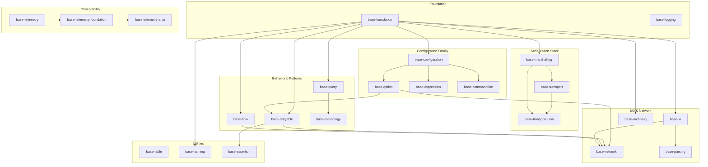
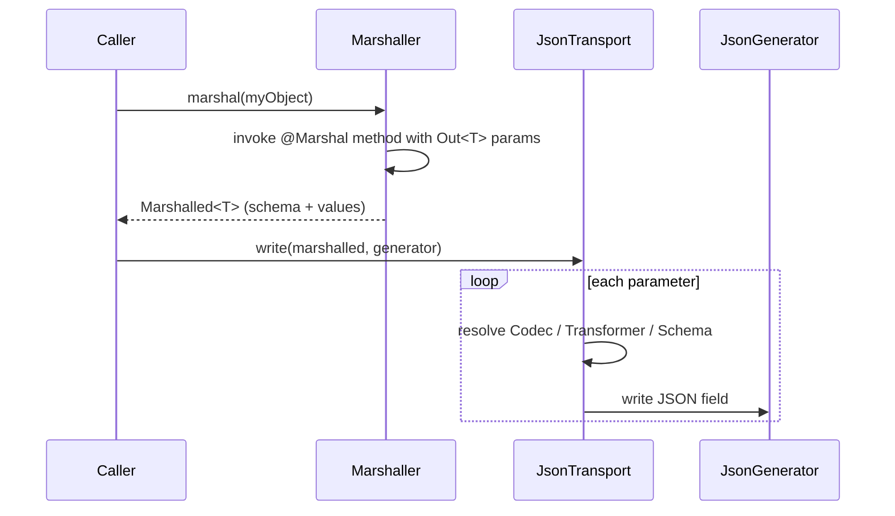
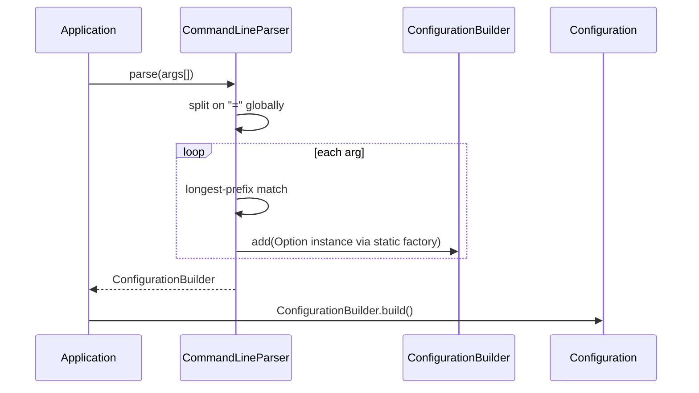
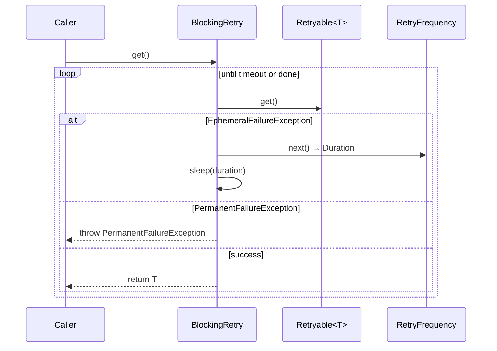

# Codebase Map

> Auto-generated by Cartographer. Last mapped: 2026-02-18T08:12:06Z

## System Overview

`base` is a **Java 25 multi-module Maven library** published by Workday, Inc. under Apache 2.0. It provides a comprehensive toolkit of foundational utilities — ranging from type-safe configuration, expression evaluation, and reactive pub/sub, to marshalling, JSON transport, composite traversal, retryable operations, telemetry, and CLI parsing. All modules share the `build.base.*` package namespace and the JPMS module system.



---

## Directory Structure

```
base/
├── base-archiving/           # JAR/TAR archive builder
├── base-assertion/           # Test-time async assertion helpers
├── base-commandline/         # CLI argument parsing → Configuration
├── base-configuration/       # Type-safe heterogeneous configuration store
├── base-expression/          # Jakarta EL expression resolution for Options
├── base-flow/                # Custom reactive Publish/Subscribe API
├── base-foundation/          # Core utilities (largest module)
│   └── src/main/java/build/base/foundation/
│       ├── iterator/         # Iterator decorators + pattern-matching DSL
│       ├── predicate/        # Predicate factories and combinators
│       ├── stream/           # Streamable<T> + Stream utilities
│       ├── tuple/            # Pair, Triple, Tuple types
│       └── unit/             # MemorySize enum
├── base-io/                  # I/O streams, PathSet, Pipe, Terminal
├── base-logging/             # JUL facade with named log levels
├── base-marshalling/         # Annotation-driven object marshalling framework
├── base-mereology/           # Part-whole (composite) traversal
├── base-naming/              # Human-readable unique name generation
├── base-network/             # TCP client-server with serializable callables
├── base-option/              # Common Option implementations (Email, Timeout, etc.)
├── base-parsing/             # Composable text scanner (LookaheadReader + DSL)
├── base-query/               # Object index + fluent query DSL
├── base-retryable/           # Retryable<T> abstraction + BlockingRetry
├── base-table/               # Plaintext tabular formatting
├── base-telemetry/           # Telemetry type hierarchy API (no implementation)
├── base-telemetry-ansi/      # ANSI terminal telemetry recorder with progress bars
├── base-telemetry-foundation/# Abstract + concrete TelemetryRecorder impls
├── base-transport/           # Transport abstraction + Transformer adapters
├── base-transport-json/      # Jackson-based JSON transport + codecs
├── config/
│   ├── checkstyle/           # Checkstyle ruleset
│   └── intellij/             # IntelliJ code style config
└── jenkins/
    ├── release/Jenkinsfile   # Full GitFlow release pipeline
    └── snapshot/Jenkinsfile  # Snapshot build pipeline
```

---

## Module Guide

### base-foundation

**Purpose:** The root of everything. Core abstractions and utilities consumed by all other modules.
**Entry point:** `build.base.foundation`
**Key files:**

| File | Purpose |
|---|---|
| `Lazy<T>` | Thread-safe, once-initialized optional-like container. Supports `map()`, `filter()`, `computeIfAbsent()`. |
| `Capture<T>` | Mutable, clearable `Optional`-like container. Ideal for lambda side-channel returns. |
| `Exceptional<T>` | Either-monad for value-or-exception. Wraps checked exceptions from suppliers. |
| `Streamable<T>` | `@FunctionalInterface` bridging `Iterable<T>` to `Stream<T>` with lazy `map()`/`filter()`. |
| `Streams` | Stream utilities: `zip`, `topologicalSort`, `sortByRequires`, `reverse`. |
| `Strings` | Rich string utilities + registry-based `convert(String, Class<T>)` for all common types. |
| `Introspection` | Memoized reflection: full type hierarchy traversal for fields, methods, annotations. |
| `Preconditions` | Returns-its-argument validation: `requireNonNull`, `require(Predicate)`, etc. |
| `ConcurrentWeakHashMap` | `ConcurrentMap` with weak keys and pluggable `Hasher<K>` strategy. |
| `Memoizer<K,V>` | Per-key-locking function memoization backed by `ConcurrentWeakHashMap`. |
| `AtomicEnum<T>` | Synchronized mutable enum wrapper with CAS semantics. |
| `TransformingIterable<T>` | Lazy fluent `Iterable` with `map`, `filter`, `distinct`, `flatten`, `abort`. |
| `iterator/matching/` | Regex-like DSL for pattern matching over `Iterator<T>`. Composable conditions with capture. |
| `predicate/Predicates` | `always()`, `never()`, `anyOf()`, `allOf()`, descriptive wrappers. |
| `tuple/Pair`, `Triple` | Immutable typed tuples; output of `Streams.zip()`. |
| `unit/MemorySize` | IEC + SI memory unit enum with parsing and pretty-printing. |
| `Primes` | Pre-computed prime table (2–9973) with O(log n) lookup. |

**Exports:** All sub-packages (`iterator`, `iterator.matching`, `predicate`, `stream`, `tuple`, `unit`).
**Dependencies:** `java.sql` (for `Strings.convert` on `Date` types).

---

### base-configuration

**Purpose:** Type-safe, class-keyed heterogeneous configuration store.
**Key APIs:**

| Type | Role |
|---|---|
| `Option` | Root marker interface for all config values |
| `ValueOption<T>` | Single typed value; extend via `AbstractValueOption<T>` |
| `MappedOption<K>` | Multiple instances keyed by `K`; e.g., multiple named `Variable`s |
| `CollectedOption<C>` | Accumulates into a `Collection`; e.g., positional CLI args |
| `ComposedOption<T>` | Merges additively with other instances via `compose()` |
| `Configuration` | Immutable read view: `get(Class)`, `get(Class, key)`, `stream(Class)` |
| `ConfigurationBuilder` | Mutable builder; also a `Collector` for stream pipelines |
| `@Default` | Marks factory for auto-detected defaults via reflection |
| `@OptionDiscriminator` | Overrides the storage key in `Configuration` to a supertype |

**Pattern:** Heterogeneous container (Effective Java Item 33). Options are keyed by their class.
**Gotcha:** `get(MappedOption.class)` always returns null — use `get(class, key)` instead.
**Dependencies:** `base-foundation`.

---

### base-option

**Purpose:** Ready-to-use `Option` implementations for common cross-cutting concerns.

| Option | Default | Notes |
|---|---|---|
| `Timeout` | 60s (or `build.base.timeout.default` sys prop) | Normalizes null/zero/negative to `ZERO` |
| `HostName` | — | Has `localhost()` factory |
| `Username` | `user.name` sys prop | |
| `WorkingDirectory` | `user.dir` sys prop | Provides `path()` |
| `TemporaryDirectory` | `java.io.tmpdir` sys prop | Provides `path()` |
| `JDKVersion` | `java.version` sys prop | Parses legacy and modern formats; reads bytecode magic |
| `Password` | — | `toString()` hides value: `Password{...}` |
| `Email`, `HostName` | — | Simple wrappers |
| `Attribute` | — | Generic `MappedOption<String>` key-value pair |

**Dependencies:** `base-configuration` (transitive), `base-foundation`.

---

### base-expression

**Purpose:** Jakarta EL (`${variable.name}`) expression resolution, integrated with the Option system.

| Type | Role |
|---|---|
| `Processor` | Replaces EL expressions in strings or resolves `ResolvableOption`s |
| `ProcessorBuilder` | Fluent builder; accepts `Resolvable`s and named `PropertyResolver`s |
| `Resolvable<T>` | Named, nullable value available to EL expressions |
| `Variable` | Concrete `Resolvable` that is also a `MappedOption<String>` |
| `ResolvableOption<T>` | An `Option` that resolves itself via a `Processor` |

**Gotcha:** Variables are stored as flat concatenated keys (e.g., `"application.version"`), not nested maps.
**Dependencies:** `base-foundation`, `base-configuration`, `jakarta.el` (API + GlassFish impl), `java.desktop`.

---

### base-commandline

**Purpose:** POSIX/GNU CLI argument parsing, populating a `ConfigurationBuilder` from `String[]`.

| Type | Role |
|---|---|
| `CommandLine` | Marker `Option`; nested `@Prefix`, `@Description` annotations |
| `CommandLineParser` | Reflectively finds `@Prefix`-annotated static factory methods; parses `String[]` |
| `CommandLine.Argument` | `CollectedOption<List>` for positional args |
| `HelpException` | Thrown on `-h`/`--help`; message contains formatted help text |

**Patterns:** `@Prefix` on static methods; longest-prefix matching; `=`-splitting at ingestion.
**Gotcha:** `=` is globally split before parsing — `--option=foo=bar` becomes three tokens.
**Dependencies:** `base-configuration` (transitive), `base-table` (transitive), `base-foundation`.

---

### base-marshalling

**Purpose:** Annotation-driven, reflection-based object marshalling framework. Converts Java objects to/from a neutral `Marshalled` intermediate form. Wire-format independent.

| Type | Role |
|---|---|
| `@Marshal` | Marks the single destructor method; uses `Out<T>` output params |
| `@Unmarshal` | Marks constructor(s) as unmarshalling entry points |
| `Marshaller` | Runtime API: `marshal(T)`, `unmarshal(Marshalled<T>)`, `bind(Class)` |
| `Marshalling` | Global entry point; holds singleton `ConcurrentSchemaFactory` |
| `Schema<T>` | Runtime descriptor for one marshal/unmarshal contract |
| `Out<T>` | Write-once output parameter holder for `@Marshal` methods |
| `Dependency` | Named, typed injection point for the marshaller |

**Patterns:** Annotation-driven factory dispatch; hierarchical DI; output-parameter pattern.
**Gotcha:** Requires `-parameters` compiler flag for parameter name resolution. `@Unmarshal` on methods (not constructors) is silently ignored.
**Dependencies:** `base-foundation`.

---

### base-transport

**Purpose:** Abstract transport contract + `Transformer` adapters for types that can't use `@Marshal`.

| Type | Role |
|---|---|
| `Transport` | Registry of `Transformer`s |
| `Transformer<X,Y>` | Symmetric `transform()` + `reform()` adapter |
| `AbstractTransport<T>` | Base impl; pre-registers `EnumTransformer`, `StreamTransformer` |
| `EnumTransformer` | `Enum` ↔ `String` |
| `StreamTransformer` | `Stream<T>` ↔ `Streamable<T>` |

**Dependencies:** `base-foundation`, `base-marshalling`.

---

### base-transport-json

**Purpose:** Jackson Streaming API-based JSON transport. Maps marshalled schemas to JSON fields; ships 20+ built-in codecs for common Java types.

| Codec | Wire Format |
|---|---|
| Primitives/boxed | JSON number/boolean/string |
| `BigDecimal`, `BigInteger` | JSON string (precision-preserving) |
| `Instant`, `LocalDate/Time/DateTime`, `ZonedDateTime`, `Period` | ISO-8601 JSON string |
| `Duration` | JSON integer (nanoseconds) |
| `Date` | JSON integer (epoch millis) |
| `Timestamp` | JSON string (JDBC format) |
| `Optional<?>` | JSON array `[]`/`[value]`; omitted when empty |
| `Streamable<T>` | JSON array; omitted when empty |

**Gotcha:** JSON field order is strict — `"type"` must be the first field in any marshalled object. `BigDecimal`/`BigInteger` are strings, not JSON numbers.
**Dependencies:** `base-foundation`, `base-marshalling`, `base-transport`, `jackson-core`, `java.sql`.

---

### base-flow

**Purpose:** Custom reactive Publish/Subscribe API (deliberately independent of `java.util.concurrent.Flow`).

| Type | Role |
|---|---|
| `Publisher<T>` / `Subscriber<T>` / `Subscription` | Reactive triad |
| `Publicist<T>` | `Producer` + `Publisher`; `complete()`, `error()` |
| `SubscriberRegistry<T>` | Thread-safe multi-subscriber hub with backpressure queuing |
| `CompletingSubscriber<T>` | Bridges events to `CompletableFuture`s via predicates |
| `FilteringSubscriber<T>` | Decorator: forwards only matching items |
| `MappingSubscriber<T,R>` | Decorator: transforms items before forwarding |
| `RecordingSubscriber<T>` | Collects all items; useful for testing |
| `LogRecordPublisher` | JUL `Handler` → `Publisher<LogRecord>` bridge |

**Gotchas:** `Subscriber` is single-use; `request()` sets (not adds) backpressure demand; `cancel()` fires `onComplete()`.
**Dependencies:** `base-foundation`, `java.logging`.

---

### base-query

**Purpose:** Annotation-driven in-memory object index with fluent query DSL.

```java
index.match(Foo.class)
     .where(Foo::getName).isEqualTo("bar")
     .scope(Scope.DepthFirst)
     .findAll();
```

| Type | Role |
|---|---|
| `@Indexable` | On class: makes type indexable. On `public static final Function` field: value-based index |
| `Index` | `index(obj)`, `unindex(obj)`, `add(Class,T)`, `remove(Class,T)` |
| `AbstractHeapBasedIndex` | Core thread-safe impl; O(1) hash lookup + fallback to traversal |
| `Scope` | `Indexed` (hash-only), `Direct`, `DepthFirst`, `BreadthFirst` |
| `Match` / `Condition` / `Terminal` | Fluent query chain |

**Gotcha:** `@Indexable` on non-`public static final` fields is silently ignored. `get()` enforces exactly-one semantics.
**Dependencies:** `base-foundation`.

---

### base-mereology

**Purpose:** Part-whole hierarchy modeling and traversal (mereology = the study of parts and wholes).

| Type | Role |
|---|---|
| `Composite` | `@FunctionalInterface`; `iterator(Class<T>)` returns direct parts of type T |
| `Traversal<T,B>` | Fluent builder: `strategy()`, `reflexive()`, `filter()`, `exclude()`, `abort()` |
| `Strategy` | `Direct`, `DepthFirst`, `BreadthFirst` |
| `Hierarchical<T>` | `Iterable<Entity<T>>` with ancestry context |
| `Entity<T>` | `object()`, `composite()` (parent), `hierarchy()`, `distance()`, `isBoundary()` |
| `HeapBasedCompositeIndex` | `AbstractHeapBasedIndex` that delegates to a `Composite` for traversal |

**Gotcha:** Default strategy is `Direct` (immediate children only) and not reflexive (root excluded).
**Dependencies:** `base-foundation`, `base-query`.

---

### base-retryable

**Purpose:** Retryable supplier abstraction with two-exception taxonomy and pluggable back-off.

| Type | Role |
|---|---|
| `Retryable<T>` | `@FunctionalInterface` supplier that throws `EphemeralFailureException` or `PermanentFailureException` |
| `BlockingRetry<T>` | Polling retry engine; configurable via `Configuration` options |
| `RetryFrequency` | `Iterable<Duration>` back-off strategy (primes, Fibonacci, exponential, periodic, etc.) |
| `ConditionallyRetryable<T>` | Retries when a value matches a predicate ("bad value" → retry) |
| `RetryablePredicate<T>` | Retries until a predicate is satisfied |
| Adapters | `RetryableSupplier`, `RetryableRunnable`, `RetryableConstant` |

**Gotcha:** `RuntimeException` (other than `UnsupportedOperationException`) is treated as ephemeral. `RetryFrequency.within()` has inverted guard conditions (latent bug). `request(n)` sets, not adds, remaining demand.
**Dependencies:** `base-foundation`, `base-configuration`, `base-option` (for `Timeout`).

---

### base-io

**Purpose:** Low-level I/O: specialized streams, path collections, async pipe, terminal abstraction.

| Type | Role |
|---|---|
| `LookaheadReader` | Peek, consume, skip with line/column tracking; underlying for `base-parsing` |
| `Pipe` | Async line-reader with `Flow` subscriber support; uses Virtual Threads |
| `PathSet` | Immutable ordered set of `Path`s; `Tabular` output |
| `PathSetBuilder` | Mutable builder; splits on `File.pathSeparator` |
| `Terminal` | Abstracts process stdout/stderr/stdin; `onClosed()` future |
| `ByteBufferInputStream` | Wraps `ByteBuffer` as `InputStream` |
| `CompletableInputStream` | Completes a future on EOF/close/error |
| `NonThreadSafeBufferedInputStream` | Lock-free replacement for `BufferedInputStream` |
| `NullReader`, `NullWriter` | Singletons for dev-null I/O |

**Dependencies:** `base-foundation`, `base-flow`, `base-table`.

---

### base-parsing

**Purpose:** Composable text scanning built on `LookaheadReader`. Position-aware, filter-driven.

| Type | Role |
|---|---|
| `Scanner` | Central class; wraps `Reader`/`String`; registered `Filter`s auto-apply before each match |
| `Filter` | `Consumer<LookaheadReader>`; predefined: `WHITESPACE`, `JAVA_SINGLE_LINE_COMMENT`, `JAVA_MULTILINE_COMMENT` |
| `Evaluator<T>` | `Predicate<Scanner>` + `Function<Scanner,T>`; created from `Pattern` + converter |
| `ParseException` | Unchecked exception with location, expected, found fields |

**Gotcha:** `available()` has side effects (applies filters). Patterns are auto-anchored to current position.
**Dependencies:** `base-foundation`, `base-io`.

---

### base-logging

**Purpose:** Thin JUL facade with named log levels and lazy `Supplier<String>` evaluation.

```java
Logger log = Logger.get(MyClass.class);
log.info(() -> "Computed: " + expensiveCall());
log.error("Failed with %s", reason);
```

Level mapping: `fatal`/`error` → `SEVERE`/`WARNING`, `warn` → `WARNING`, `info` → `INFO`, `config` → `CONFIG`, `debug` → `FINE`, `trace` → `FINEST`.
**Dependencies:** `java.logging`, `base-foundation`.

---

### base-naming

**Purpose:** Generates unique human-readable names (adjective + first + last name) via prime-step traversal of word arrays.

```java
UniqueNameGenerator gen = new UniqueNameGenerator();
String name = gen.next(); // e.g., "Vibrant Salva Maiorano"
```

~240 adjectives × ~400 first names × ~900 last names ≈ 86M unique names.
**Dependencies:** `base-foundation` (for `Primes`).

---

### base-network

**Purpose:** TCP client-server with serializable callable dispatch and pub-sub over connections.

| Type | Role |
|---|---|
| `Server` | Daemon-thread acceptor; maps remote identity to `Connection` |
| `Client` | Wraps `Connection`; `submit(SerializableCallable<T>)` → future result |
| `Connection` | Bidirectional framed channel; 3 operations: `REQUEST`, `RESPONSE`, `PUBLISH` |
| `EphemeralPortSupplier` | OS-assigned port acquisition with cross-address leasing |
| `Network` | Static utils: `isReachable`, `connect` (async retry), `reachableLocalAddresses` |

**Warning:** Uses Java serialization — both sides must share class definitions.
**Dependencies:** `base-foundation`, `base-configuration`, `base-option`, `base-retryable`, `base-io`, `base-flow`.

---

### base-archiving

**Purpose:** Fluent in-memory archive builder materializing to JAR or TAR on disk.

```java
JarBuilder jar = new JarBuilder()
    .withMainClass(Main.class)
    .directory("lib").parent()
    .file("lib/helper.txt", content)
    .build(outputPath);
```

**Dependencies:** `base-foundation`, `base-configuration`, `base-option`, `jtar` (external).

---

### base-assertion

**Purpose:** Test-time assertion helpers for `CompletableFuture<T>` and `Retryable<T>`.

```java
Eventually.assertThat(myFuture).withTimeout(timeout).isCompleted();
Eventually.assertThat(myRetryable).isEqualTo(expectedValue);
```

**Dependencies:** `base-foundation`, `base-retryable`, `base-option`, `assertj-core`.

---

### base-table

**Purpose:** Plaintext table formatting (Cell → Row → Table with configurable alignment, separator, width).

```java
Table.of(
    Row.header(Cell.of("Name"), Cell.of("Value")),
    Row.of(Cell.of("timeout"), Cell.of("60s"))
).toString();
```

Options cascade: Cell → Row → Table. `RowComparator` sorts non-header rows.
**Dependencies:** `base-configuration` (transitive), `base-foundation`.

---

### base-telemetry

**Purpose:** Pure API — telemetry type hierarchy and `TelemetryRecorder` contract. No implementations here.

| Type | Role |
|---|---|
| `TelemetryRecorder` | Abstract recording API; `info`, `warn`, `error`, `fatal`, `diagnostic`, `commence` |
| `Activity` / `Meter` | `AutoCloseable` in-progress operations; `Meter` adds `progress()` |
| `Telemetry` subtypes | `Information`, `Advice`, `Warning`, `Error`, `Fatal`, `Diagnostic`, `Commenced`, `Completed<T>`, `Progress` |
| `Location` / `TextualPosition` / `TextualRange` | Source location attached to telemetry |

**Dependencies:** none.

---

### base-telemetry-foundation

**Purpose:** Concrete `TelemetryRecorder` implementations.

| Impl | Behavior |
|---|---|
| `AbstractTelemetryRecorder` | Template; single abstract `record(T)` |
| `NoOpTelemetryRecorder` | Silent discard |
| `PrintStreamTelemetryRecorder` | Output + error stream routing |
| `SystemTelemetryRecorder` | `System.out` / `System.err` |
| `MessagerBasedTelemetryRecorder` | Annotation-processor `javax.tools.Messager` adapter |
| `ObservableTelemetryRecorder` | Decorator that captures all telemetry for test assertions |

**Dependencies:** `base-foundation`, `base-telemetry`, `java.compiler`.

---

### base-telemetry-ansi

**Purpose:** ANSI terminal `TelemetryRecorder` with live in-terminal progress bars.

- Virtual Thread render loop fires every 1 second.
- Non-progress telemetry prints inline with ANSI clear-line escape.
- `ProgressBar` renders a 20-char `#`-filled bar with percentage and count.

**Dependencies:** `base-foundation`, `base-telemetry-foundation` (transitive), `java.compiler`.

---

## Data Flow

### Marshalling → JSON Transport



### Configuration Population from CLI



### Retryable Execution



---

## Conventions

### Naming
- All public packages: `build.base.<module-name>` (e.g., `build.base.foundation`, `build.base.transport.json`)
- Static factory methods: `of(...)`, `create(...)`, `empty()`, `get()`
- Abstract base classes: `Abstract*` prefix
- Functional interfaces: used extensively; prefer lambdas over anonymous classes

### Design Patterns in Use
- **Heterogeneous container** — `Configuration` keyed by `Class<? extends Option>`
- **Output parameter** — `Out<T>` in `@Marshal` methods
- **Returns-its-argument validation** — `Preconditions` returns the validated value
- **Lazy by default** — `Lazy<T>`, `LazilyMapped`, `TransformingIterable`, `Streamable.map/filter`
- **Null-avoidance** — `Optional`, `Lazy<T>`, `Capture<T>`, `Exceptional<T>` — raw `null` propagation is rare
- **Pluggable strategies** — `Hasher<K>`, `Predicate<T>`, `RetryFrequency`, `Transformer`, `Codec`

### Configuration Pattern
Every module that is configurable follows this pattern:
```java
Configuration config = new ConfigurationBuilder()
    .add(Timeout.ofSeconds(30))
    .add(HostName.of("example.com"))
    .build();

Timeout timeout = config.get(Timeout.class); // uses @Default if not explicitly set
```

### Module System (JPMS)
All modules use JPMS `module-info.java`. Most are open modules (allowing deep reflection for the marshalling infrastructure). Test dependencies are on the classpath (not the module path).

---

## Gotchas

1. **`-parameters` compiler flag is required** for `base-marshalling` to correctly resolve parameter names. Without it, parameters default to `arg0`, `arg1`, etc.

2. **`Subscriber` is single-use** in `base-flow`. Reuse across publishers throws `IllegalStateException`.

3. **`request(n)` in `base-flow` is a setter, not an increment** — multiple `request()` calls do not accumulate; the last call wins.

4. **`@Indexable` on non-`public static final` fields** is silently ignored in `base-query`.

5. **`get(MappedOption.class)` always returns null** in `Configuration` — use `get(class, key)` for mapped options.

6. **Java serialization** in `base-network` — both client and server must share identical class definitions.

7. **`RetryFrequency.within(floor, ceiling)` has inverted guards** — valid inputs throw `IllegalArgumentException` (latent bug).

8. **JSON field order is strict** in `base-transport-json` — `"type"` must appear first in marshalled objects.

9. **`BigDecimal`/`BigInteger` serialize as JSON strings**, not JSON numbers — not interoperable with tools expecting numeric tokens.

10. **`=` is globally split before parsing** in `base-commandline` — `--option=foo=bar` becomes three tokens.

11. **`LazilyMapped.isPresent()` delegates to the underlying** — a mapped value is considered "present" even if the mapping function would return `null`.

12. **`Progress.percentage()` uses integer division** in `base-telemetry`.

---

## Navigation Guide

**To add a new configuration option:**
- Create a class extending `AbstractValueOption<T>` in the appropriate module
- Add `@Default` static method for auto-detection if applicable
- Register `@CommandLine.Prefix` on static factory if it should be CLI-settable
- Files to touch: one new class file; optionally `module-info.java` exports

**To add a new marshallable type:**
- Annotate destructor method with `@Marshal`, constructor(s) with `@Unmarshal`
- Call `Marshalling.register(MyClass.class, MethodHandles.lookup())` in a static initializer
- Files to touch: the class file only

**To add a new JSON codec:**
- Implement `Codec<T>` (or `ConditionalCodec<T>` for nullable/optional fields)
- Register via `jsonTransport.register(new MyCodec())`
- Files to touch: new `Codec` class; registration site

**To add a new retryable operation:**
- Implement `Retryable<T>` (or use `Retryable.of(supplier)`)
- Wrap in `BlockingRetry` for automatic polling
- Throw `EphemeralFailureException` for transient errors, `PermanentFailureException` for terminal ones

**To add a new telemetry recorder:**
- Extend `AbstractTelemetryRecorder` from `base-telemetry-foundation`
- Override `record(T telemetry)` and `uri()`
- Implement `factory()` if needed for programmatic creation

**To traverse a composite hierarchy:**
```java
composite.traverse(MyType.class)
    .strategy(Strategy.DepthFirst)
    .filter(t -> t.isActive())
    .stream()
    .forEach(System.out::println);
```

**To query an indexed object graph:**
```java
index.match(MyType.class)
    .where(MyType::getName).isEqualTo("target")
    .scope(Scope.DepthFirst)
    .findFirst();
```

**To build and run a CLI application:**
```java
CommandLineParser parser = new CommandLineParser()
    .add(MyOption.class)
    .add(Timeout.class);
Configuration config = parser.parse(args).build();
Timeout timeout = config.get(Timeout.class); // defaults to 60s
```
