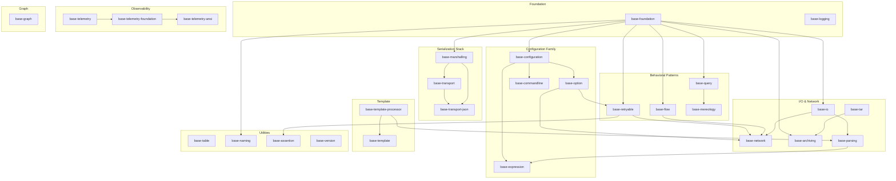
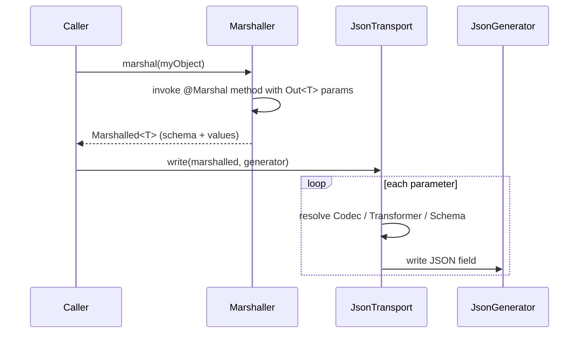
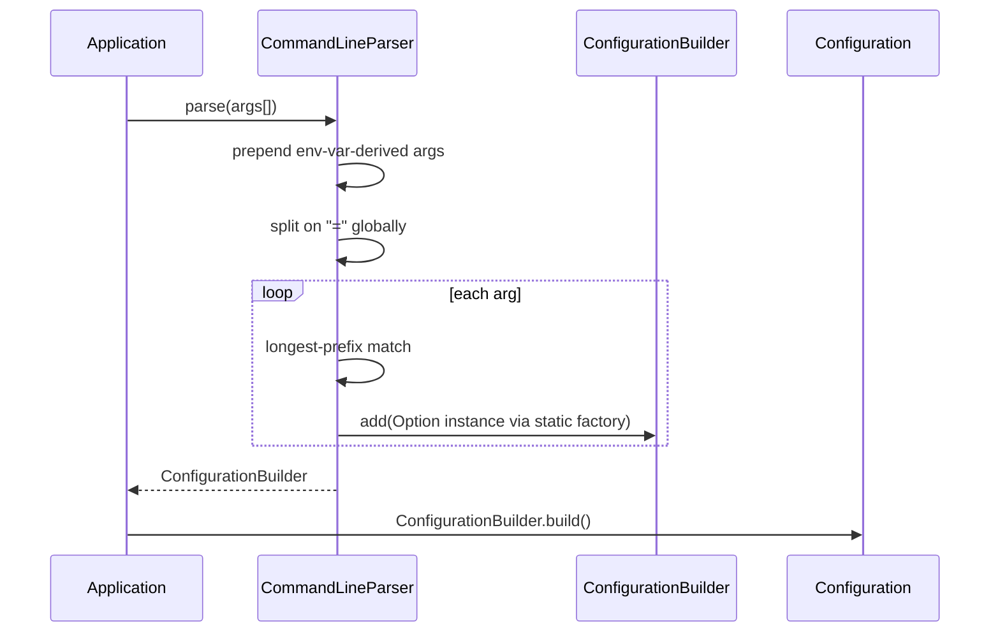
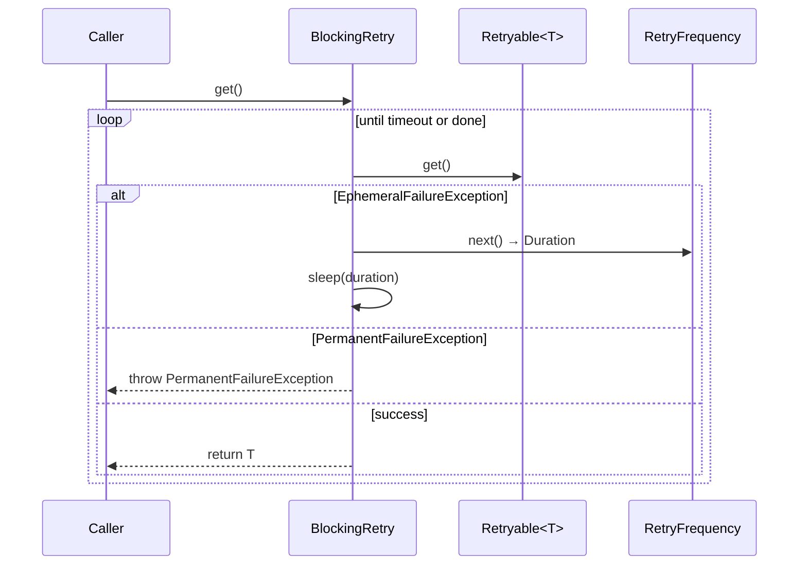
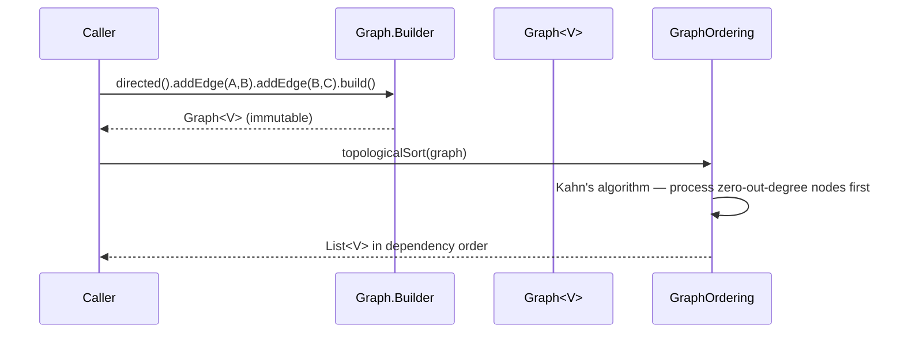

# Codebase Map

> Auto-generated by Cartographer. Last mapped: 2026-04-20T00:00:00Z

## System Overview

`base` is a **Java 25 multi-module Maven library** published by Workday, Inc. under Apache 2.0. It provides a comprehensive toolkit of foundational utilities — ranging from type-safe configuration, expression evaluation, and reactive pub/sub, to marshalling, JSON transport, composite traversal, retryable operations, telemetry, and CLI parsing. All modules share the `build.base.*` package namespace and the JPMS module system.


```mermaid
graph TB
    subgraph Foundation
        F[base-foundation]
        LOG[base-logging]
    end

    subgraph "Configuration Family"
        CFG[base-configuration]
        OPT[base-option]
        EXPR[base-expression]
        CLI[base-commandline]
    end

    subgraph "Serialization Stack"
        MARSH[base-marshalling]
        TRANS[base-transport]
        JSON[base-transport-json]
    end

    subgraph "Behavioral Patterns"
        RETRY[base-retryable]
        FLOW[base-flow]
        QUERY[base-query]
        MERE[base-mereology]
    end

    subgraph "I/O & Network"
        IO[base-io]
        NET[base-network]
        ARCH[base-archiving]
        TAR[base-tar]
        PARSE[base-parsing]
    end

    subgraph "Observability"
        TEL[base-telemetry]
        TELF[base-telemetry-foundation]
        TELA[base-telemetry-ansi]
    end

    subgraph "Template"
        TMPL[base-template]
        TMPLP[base-template-processor]
    end

    subgraph "Utilities"
        TABLE[base-table]
        NAME[base-naming]
        ASSERT[base-assertion]
        VER[base-version]
    end

    subgraph "Graph"
        GRAPH[base-graph]
    end

    F --> CFG
    F --> MARSH
    F --> FLOW
    F --> QUERY
    F --> RETRY
    CFG --> OPT
    CFG --> EXPR
    CFG --> CLI
    OPT --> RETRY
    MARSH --> TRANS
    TRANS --> JSON
    MARSH --> JSON
    QUERY --> MERE
    OPT --> NET
    RETRY --> NET
    FLOW --> NET
    IO --> NET
    IO --> PARSE
    F --> IO
    F --> NAME
    F --> ARCH
    TAR --> ARCH
    TEL --> TELF
    TELF --> TELA
    TMPLP --> TMPL
    TMPLP --> PARSE
    RETRY --> ASSERT
    PARSE --> EXPR
```

---

## Directory Structure

```
base/
├── base-archiving/           # JAR/TAR archive builder (depends on base-tar)
├── base-assertion/           # Test-time async assertion helpers
├── base-commandline/         # CLI argument parsing → Configuration; Command fluent builder
├── base-configuration/       # Type-safe heterogeneous configuration store
├── base-expression/          # Native Jakarta EL 6.0 implementation; Processor compat layer
├── base-flow/                # Custom reactive Publish/Subscribe API
├── base-foundation/          # Core utilities (largest module)
│   └── src/main/java/build/base/foundation/
│       ├── iterator/         # Iterator decorators + pattern-matching DSL
│       ├── predicate/        # Predicate factories and combinators
│       ├── stream/           # Streamable<T> + Stream utilities
│       ├── tuple/            # Pair, Triple, Tuple types
│       └── unit/             # MemorySize enum
├── base-graph/               # Immutable directed/undirected graph library + algorithms
├── base-io/                  # I/O streams, PathSet, Pipe, Terminal
├── base-logging/             # JUL facade with named log levels
├── base-marshalling/         # Annotation-driven object marshalling framework
├── base-mereology/           # Part-whole (composite) traversal
├── base-naming/              # Human-readable unique name generation
├── base-network/             # TCP client-server with serializable callables
├── base-option/              # Common Option implementations (Email, Timeout, etc.)
├── base-parsing/             # Generic expression and template parser infrastructure
├── base-query/               # Object index + fluent query DSL
├── base-retryable/           # Retryable<T> abstraction + BlockingRetry
├── base-table/               # Plaintext tabular formatting
├── base-tar/                 # Zero-dependency POSIX ustar TAR writer
├── base-telemetry/           # Telemetry type hierarchy API (no implementation)
├── base-telemetry-ansi/      # ANSI terminal telemetry recorder with progress bars
├── base-telemetry-foundation/# Abstract + concrete TelemetryRecorder impls
├── base-template/            # Runtime: Template<O>, HtmlOut (escaping), TextOut, @ProcessTemplates
├── base-template-processor/  # APT: compiles .jt template files into Java records at build time
├── base-template-test/       # Integration tests for base-template-processor (not published)
├── base-transport/           # Transport abstraction + Transformer adapters
├── base-transport-json/      # Jackson-based JSON transport + codecs
├── base-version/             # Version parsing, comparison, ranges, constraints
├── .github/workflows/
│   ├── main-pull-request.yml # PR validation build
│   ├── publish-snapshot.yml  # Snapshot publish to Maven Central on merge
│   └── release.yml           # Full GitFlow release → Maven Central
├── config/
│   ├── checkstyle/           # Checkstyle ruleset
│   └── intellij/             # IntelliJ code style config
└── jenkins/
    ├── release/Jenkinsfile   # Legacy Jenkins release pipeline (superseded by GH Actions)
    └── snapshot/Jenkinsfile  # Legacy Jenkins snapshot pipeline (superseded by GH Actions)
```

---

## Module Guide

### base-foundation

**Purpose:** The root of everything. Core abstractions and utilities consumed by all other modules.
**Entry point:** `build.base.foundation`
**Key files:**

| File | Purpose |
|---|---|
| `Lazy<T>` | Thread-safe, once-initialized optional-like container. Supports `map()`, `filter()`, `computeIfAbsent()`. |
| `Capture<T>` | Mutable, clearable `Optional`-like container. Ideal for lambda side-channel returns. |
| `Exceptional<T>` | Either-monad for value-or-exception. Wraps checked exceptions from suppliers. |
| `Streamable<T>` | `@FunctionalInterface` bridging `Iterable<T>` to `Stream<T>` with lazy `map()`/`filter()`. |
| `Streams` | Stream utilities: `zip`, `topologicalSort`, `sortByRequires`, `reverse`. |
| `Strings` | Rich string utilities + registry-based `convert(String, Class<T>)` for all common types. |
| `Introspection` | Memoized reflection: full type hierarchy traversal for fields, methods, annotations. |
| `Preconditions` | Returns-its-argument validation: `requireNonNull`, `require(Predicate)`, etc. |
| `ConcurrentWeakHashMap` | `ConcurrentMap` with weak keys and pluggable `Hasher<K>` strategy. |
| `Memoizer<K,V>` | Per-key-locking function memoization backed by `ConcurrentWeakHashMap`. |
| `AtomicEnum<T>` | Synchronized mutable enum wrapper with CAS semantics. |
| `TransformingIterable<T>` | Lazy fluent `Iterable` with `map`, `filter`, `distinct`, `flatten`, `abort`. |
| `iterator/matching/` | Regex-like DSL for pattern matching over `Iterator<T>`. Composable conditions with capture. |
| `predicate/Predicates` | `always()`, `never()`, `anyOf()`, `allOf()`, descriptive wrappers. |
| `tuple/Pair`, `Triple` | Immutable typed tuples; output of `Streams.zip()`. |
| `unit/MemorySize` | IEC + SI memory unit enum with parsing and pretty-printing. |
| `Primes` | Pre-computed prime table (2–9973) with O(log n) lookup. |

**Exports:** All sub-packages (`iterator`, `iterator.matching`, `predicate`, `stream`, `tuple`, `unit`).
**Dependencies:** `java.sql` (for `Strings.convert` on `Date` types).

---

### base-configuration

**Purpose:** Type-safe, class-keyed heterogeneous configuration store.
**Key APIs:**

| Type | Role |
|---|---|
| `Option` | Root marker interface for all config values |
| `ValueOption<T>` | Single typed value; extend via `AbstractValueOption<T>` |
| `MappedOption<K>` | Multiple instances keyed by `K`; e.g., multiple named `Variable`s |
| `CollectedOption<C>` | Accumulates into a `Collection`; e.g., positional CLI args |
| `ComposedOption<T>` | Merges additively with other instances via `compose()` |
| `Configuration` | Immutable read view: `get(Class)`, `get(Class, key)`, `stream(Class)` |
| `ConfigurationBuilder` | Mutable builder; also a `Collector` for stream pipelines |
| `@Default` | Marks factory for auto-detected defaults via reflection |
| `@OptionDiscriminator` | Overrides the storage key in `Configuration` to a supertype |

**Pattern:** Heterogeneous container (Effective Java Item 33). Options are keyed by their class.
**Gotcha:** `get(MappedOption.class)` always returns null — use `get(class, key)` instead.
**Dependencies:** `base-foundation`.

---

### base-option

**Purpose:** Ready-to-use `Option` implementations for common cross-cutting concerns.

| Option | Default | Notes |
|---|---|---|
| `Timeout` | 60s (or `build.base.timeout.default` sys prop) | Normalizes null/zero/negative to `ZERO` |
| `HostName` | — | Has `localhost()` factory |
| `Username` | `user.name` sys prop | |
| `WorkingDirectory` | `user.dir` sys prop | Provides `path()` |
| `TemporaryDirectory` | `java.io.tmpdir` sys prop | Provides `path()` |
| `JDKVersion` | `java.version` sys prop | Parses legacy and modern formats; reads bytecode magic |
| `Password` | — | `toString()` hides value: `Password{...}` |
| `Email`, `HostName` | — | Simple wrappers |
| `Attribute` | — | Generic `MappedOption<String>` key-value pair |

**Dependencies:** `base-configuration` (transitive), `base-foundation`.

---

### base-expression

**Purpose:** Native Jakarta EL 6.0 implementation — parsing, AST, evaluation, and type coercion. Registered as a Jakarta EL `ExpressionFactory` SPI so `ExpressionFactory.newInstance()` discovers it automatically. The high-level `Processor`/`Variable` API is still present but marked `@Deprecated` — callers should migrate to the Jakarta EL API directly.

| Type | Role |
|---|---|
| `el.ExpressionFactoryImpl` | `ExpressionFactory` SPI entry-point; discovered via `module-info provides` |
| `el.ValueExpressionImpl` | Full `ValueExpression` — evaluates, assigns, reports read-only status |
| `el.MethodExpressionImpl` | `MethodExpression` — handles both `${bean.method}` reference and `${bean.method(arg)}` call forms |
| `parser.ELParser` | Recursive-descent parser built on `base-parsing`'s `Scanner`; three entry points: `parseFull`, `parseComposite`, `parseExpression` |
| `ast.Node` (sealed) | AST hierarchy root — 12 permitted record/class subtypes covering all EL expression forms |
| `eval.NodeEvaluator` | Visitor-style evaluator via pattern-matching `switch` over the sealed `Node` hierarchy |
| `eval.TypeCoercion` | EL spec §1.23 coercion: all primitives, `BigDecimal`, `BigInteger`, `Character`, enums |
| `eval.Arithmetic` | EL spec §§1.7–1.9: promotion chain `BigDecimal` > `Double` > `BigInteger` > `Long` |
| `compat.Processor` | **Deprecated** high-level facade; wraps `ELProcessor` — retained for migration |
| `option.ResolvableOption<T>` | Active (not deprecated): `Option` that resolves itself via a `Processor` |

**Gotchas:**
- `build.base.expression.el` is **not exported** — its `public` types are module-internal only.
- EL string escape sequences: only `\"`, `\'`, and `\\` are expanded; `\n`, `\t`, `\r` are passed through as literal two-character sequences.
- `MethodExpressionImpl.invoke`: when the expression embeds args (`${bean.method(x)}`), caller-supplied `params` are silently ignored.

**Dependencies:** `base-foundation`, `base-configuration`, `base-parsing`, `jakarta.el` (API only — this module IS the runtime).

---

### base-commandline

**Purpose:** POSIX/GNU CLI argument parsing, populating a `ConfigurationBuilder` from `String[]`. Includes a fluent `Command` builder, environment variable fallback, help section grouping, declarative commands/categories, multi-prefix options, and a positional argument consumer.

| Type | Role |
|---|---|
| `CommandLineParser` | Core parser; registers `Option` classes by prefix, parses `String[]` into `ConfigurationBuilder` |
| `CommandLine` | Marker interface + annotation nest; `@Prefix` (repeatable via `@Prefixes`), `@Description`; inner `Argument` class |
| `Command` | Fluent builder: `Command.create("name").argument(...).section(...).option(...).envVar(...).command(...).category(...).build()` |
| `CommandLineParser.UnknownOptionConsumer` | `@FunctionalInterface`; `boolean consume(String arg, ConfigurationBuilder)` |
| `CommandLineParser.HelpException` | `RuntimeException` whose `getMessage()` is the formatted help text |

**Key builder methods:**

| Method | Description |
|---|---|
| `.argument(String label)` | Positional label in `Usage:` line (e.g. `"<task>..."`) |
| `.section(String name)` | Groups subsequent options under a named heading in help |
| `.option(Class<? extends Option>)` | Annotation-driven registration via `@CommandLine.Prefix` |
| `.option(List<String> prefixes, Class, method, description, paramTypes...)` | Multi-prefix registration with explicit help description |
| `.envVar(envVarName, prefix)` | Env var → prefix mapping; matched env vars are prepended before real args |
| `.envVarResolver(Function<String, Optional<String>>)` | Custom env var lookup (useful in tests; `null` disables) |
| `.positionalArgument(Consumer<String>)` | Receives non-hyphen, non-prefix tokens (e.g., task names); preferred over `CAPTURE_UNKNOWN_OPTIONS_AS_ARGUMENTS` |
| `.command(name, description)` | Declares a subcommand for display in `Commands:` help block (no parsing effect) |
| `.category(name, description)` | Declares a category for display in `Categories:` help block (no parsing effect) |
| `.commandsSectionName(String)` | Override `"Commands:"` heading (e.g. `"Tasks:"`) |
| `.categoriesSectionName(String)` | Override `"Categories:"` heading (e.g. `"Aliases:"`) |
| `.helpHandler(Consumer<String>)` | Replaces `HelpException`; `parse()` returns an empty builder when help is invoked |
| `.unknownOption(UnknownOptionConsumer)` | Fallback for unrecognized tokens |
| `.build()` | Constructs and configures a `CommandLineParser`; reflective errors surface here as `IllegalArgumentException` |

**Constants:**

| Constant | Description |
|---|---|
| `IGNORE_UNKNOWN_OPTIONS` | Pre-built consumer; silently accepts all unrecognized tokens |
| `CAPTURE_UNKNOWN_OPTIONS_AS_ARGUMENTS` | Pre-built consumer; wraps non-hyphen unknowns as `CommandLine.Argument` in the builder |

**Multi-prefix options:** A factory method may carry multiple `@CommandLine.Prefix` annotations (repeatable via `@CommandLine.Prefixes`). All prefixes map to the same method; help output collects them on a single row, sorted short-before-long.

**Prefix matching:** Longest-prefix-first (via a comparator-sorted `TreeMap`). Prefix matching uses `startsWith`, not exact match — enabling `-Dkey=value` style (prefix `-D`, remaining passed as first parameter).

**Gotchas:**
- Env-var args are prepended — explicit CLI args always override them (last-write-wins during parsing).
- `=` is globally split before parsing — `--option=foo=bar` becomes three tokens.
- `CAPTURE_UNKNOWN_OPTIONS_AS_ARGUMENTS` does not capture hyphen-prefixed unrecognized tokens; those route to the `UnknownOptionConsumer`.
- `.positionalArgument()` handles non-hyphen tokens before the `UnknownOptionConsumer` sees them. When both are set, the unknown option consumer only sees hyphen-prefixed unknowns.
- `.command()` and `.category()` are purely declarative (help text only) — routing to subcommand logic is the application's responsibility.
- Conflicting prefixes (two `@Prefix`-annotated methods on different classes with the same prefix) throw `IllegalArgumentException` at parse time unless `--option-class <FQN>` precedes the ambiguous token.
- `NoSuchMethodException` from explicit option registration surfaces as `IllegalArgumentException` at `.build()` time, not at `.option(...)` call time.

**Dependencies:** `base-configuration` (transitive), `base-table` (transitive), `base-foundation`.

---

### base-marshalling

**Purpose:** Annotation-driven, reflection-based object marshalling framework. Converts Java objects to/from a neutral `Marshalled` intermediate form. Wire-format independent. Shallow (non-recursive) by design.

| Type | Role |
|---|---|
| `@Marshal` | Marks the single destructor method; `Out<T>` params receive marshalled values |
| `@Unmarshal` | Marks constructor(s) as unmarshalling entry points; **constructors only** |
| `@Bound` | Marks a constructor parameter as a bound dependency (injected, not from marshalled values) |
| `Marshaller` | Runtime API: `marshal(T)`, `unmarshal(Marshalled<T>)`, `bind(Class<T>).to(value)` |
| `Marshalling` | Global entry point; holds singleton `ConcurrentSchemaFactory`; `register`, `registerEnum`, `newMarshaller` |
| `SchemaFactory` | Maintains registrations; produces `Marshaller` instances |
| `Schema<T>` | Runtime descriptor: `owner()`, `parameters()`, `dependencies()`, `getParameter(String)` |
| `Marshalled<T>` | Intermediate form: `Schema<T>` + ordered `Streamable<Object>` of parameter values |
| `Out<T>` | Write-once output parameter holder for `@Marshal` methods; `Supplier<T>`; non-thread-safe |
| `Dependency` | Named, typed injection point for the marshaller |
| `Binding<T>` / `BindingBuilder<T>` | Fluent API for supplying `@Bound` dependencies: `marshaller.bind(Dep.class).to(value)` |

**Registration patterns:**

```java
// Option A — self-registration (preferred): must call from inside the class
static { Marshalling.register(MyClass.class, MethodHandles.lookup()); }

// Option B — external registration (only if the class is accessible)
Marshalling.register(MyClass.class);

// Option C — enum registration (no lookup required)
static { Marshalling.registerEnum(Color.class); }
```

**Enum marshalling (`registerEnum`):** Enums cannot carry `@Marshal`/`@Unmarshal` (compiler-generated constructors). `registerEnum` creates a synthetic one-parameter schema named `"name"` of type `String`. Marshalling captures `Enum#name()`; unmarshalling calls `Enum.valueOf(enumClass, name)`. Enum schemas are stored separately from regular marshalling schemas and bypass the lookup/reflection machinery entirely.

**Shallow marshalling:** Marshalling is one layer deep. Fields holding other marshallable objects are stored as-is in `Marshalled#values()` — they are NOT automatically marshalled. To serialize nested objects, the `@Marshal` method must accept `Out<Marshalled<NestedType>>` and marshal explicitly.

**Patterns:** Annotation-driven factory dispatch; output-parameter destructor; hierarchical DI via `@Bound`.
**Dependencies:** `base-foundation`.

---

### base-transport

**Purpose:** Abstract transport contract + `Transformer` adapters for types that can't use `@Marshal`.

| Type | Role |
|---|---|
| `Transport` | Registry of `Transformer`s |
| `Transformer<X,Y>` | Symmetric `transform()` + `reform()` adapter |
| `AbstractTransport<T>` | Base impl; pre-registers `EnumTransformer`, `StreamTransformer` |
| `EnumTransformer` | `Enum` ↔ `String` |
| `StreamTransformer` | `Stream<T>` ↔ `Streamable<T>` |

**Dependencies:** `base-foundation`, `base-marshalling`.

---

### base-transport-json

**Purpose:** Jackson Streaming API-based JSON transport. Maps marshalled schemas to JSON fields; ships 20+ built-in codecs for common Java types.

| Codec | Wire Format |
|---|---|
| Primitives/boxed | JSON number/boolean/string |
| `BigDecimal`, `BigInteger` | JSON string (precision-preserving) |
| `Instant`, `LocalDate/Time/DateTime`, `ZonedDateTime`, `Period` | ISO-8601 JSON string |
| `Duration` | JSON integer (nanoseconds) |
| `Date` | JSON integer (epoch millis) |
| `Timestamp` | JSON string (JDBC format) |
| `Optional<?>` | JSON array `[]`/`[value]`; omitted when empty |
| `Streamable<T>` | JSON array; omitted when empty |

**Gotcha:** JSON field order is strict — `"type"` must be the first field in any marshalled object. `BigDecimal`/`BigInteger` are strings, not JSON numbers.
**Dependencies:** `base-foundation`, `base-marshalling`, `base-transport`, `jackson-core`, `java.sql`.

---

### base-flow

**Purpose:** Custom reactive Publish/Subscribe API (deliberately independent of `java.util.concurrent.Flow`).

| Type | Role |
|---|---|
| `Publisher<T>` / `Subscriber<T>` / `Subscription` | Reactive triad |
| `Publicist<T>` | `Producer` + `Publisher`; `complete()`, `error()` |
| `SubscriberRegistry<T>` | Thread-safe multi-subscriber hub with backpressure queuing |
| `CompletingSubscriber<T>` | Bridges events to `CompletableFuture`s via predicates |
| `FilteringSubscriber<T>` | Decorator: forwards only matching items |
| `MappingSubscriber<T,R>` | Decorator: transforms items before forwarding |
| `RecordingSubscriber<T>` | Collects all items; useful for testing |
| `LogRecordPublisher` | JUL `Handler` → `Publisher<LogRecord>` bridge |

**Gotchas:** `Subscriber` is single-use; `request()` sets (not adds) backpressure demand; `cancel()` fires `onComplete()`.
**Dependencies:** `base-foundation`, `java.logging`.

---

### base-query

**Purpose:** Annotation-driven in-memory object index with fluent query DSL.

```java
index.match(Foo.class)
     .where(Foo::getName).isEqualTo("bar")
     .scope(Scope.DepthFirst)
     .findAll();
```

| Type | Role |
|---|---|
| `@Indexable` | On class: makes type indexable. On `public static final Function` field: value-based index |
| `Index` | `index(obj)`, `unindex(obj)`, `add(Class,T)`, `remove(Class,T)` |
| `AbstractHeapBasedIndex` | Core thread-safe impl; O(1) hash lookup + fallback to traversal |
| `Scope` | `Indexed` (hash-only), `Direct`, `DepthFirst`, `BreadthFirst` |
| `Match` / `Condition` / `Terminal` | Fluent query chain |

**Gotcha:** `@Indexable` on non-`public static final` fields is silently ignored. `get()` enforces exactly-one semantics.
**Dependencies:** `base-foundation`.

---

### base-mereology

**Purpose:** Part-whole hierarchy modeling and traversal (mereology = the study of parts and wholes).

| Type | Role |
|---|---|
| `Composite` | `@FunctionalInterface`; `iterator(Class<T>)` returns direct parts of type T |
| `Traversal<T,B>` | Fluent builder: `strategy()`, `reflexive()`, `filter()`, `exclude()`, `abort()` |
| `Strategy` | `Direct`, `DepthFirst`, `BreadthFirst` |
| `Hierarchical<T>` | `Iterable<Entity<T>>` with ancestry context |
| `Entity<T>` | `object()`, `composite()` (parent), `hierarchy()`, `distance()`, `isBoundary()` |
| `HeapBasedCompositeIndex` | `AbstractHeapBasedIndex` that delegates to a `Composite` for traversal |

**Gotcha:** Default strategy is `Direct` (immediate children only) and not reflexive (root excluded).
**Dependencies:** `base-foundation`, `base-query`.

---

### base-retryable

**Purpose:** Retryable supplier abstraction with two-exception taxonomy and pluggable back-off.

| Type | Role |
|---|---|
| `Retryable<T>` | `@FunctionalInterface` supplier that throws `EphemeralFailureException` or `PermanentFailureException` |
| `BlockingRetry<T>` | Polling retry engine; configurable via `Configuration` options |
| `RetryFrequency` | `Iterable<Duration>` back-off strategy (primes, Fibonacci, exponential, periodic, etc.) |
| `ConditionallyRetryable<T>` | Retries when a value matches a predicate ("bad value" → retry) |
| `RetryablePredicate<T>` | Retries until a predicate is satisfied |
| Adapters | `RetryableSupplier`, `RetryableRunnable`, `RetryableConstant` |

**Gotcha:** `RuntimeException` (other than `UnsupportedOperationException`) is treated as ephemeral. `RetryFrequency.within()` has inverted guard conditions (latent bug).
**Dependencies:** `base-foundation`, `base-configuration`, `base-option` (for `Timeout`).

---

### base-io

**Purpose:** Low-level I/O: specialized streams, path collections, async pipe, terminal abstraction.

| Type | Role |
|---|---|
| `LookaheadReader` | Peek, consume, skip with line/column tracking; underlying for `base-parsing` |
| `Pipe` | Async line-reader with `Flow` subscriber support; uses Virtual Threads |
| `PathSet` | Immutable ordered set of `Path`s; `Tabular` output |
| `PathSetBuilder` | Mutable builder; splits on `File.pathSeparator` |
| `Terminal` | Abstracts process stdout/stderr/stdin; `onClosed()` future |
| `ByteBufferInputStream` | Wraps `ByteBuffer` as `InputStream` |
| `CompletableInputStream` | Completes a future on EOF/close/error |
| `NonThreadSafeBufferedInputStream` | Lock-free replacement for `BufferedInputStream` |
| `NullReader`, `NullWriter` | Singletons for dev-null I/O |

**Dependencies:** `base-foundation`, `base-flow`, `base-table`.

---

### base-parsing

**Purpose:** Generic expression and template parser infrastructure. Provides a reusable `Scanner`, `Tokenizer`, `ExpressionParser`, and `TemplateParser` that any module can compose to build a custom grammar.

| Type | Role |
|---|---|
| `Scanner` | Stateful character-level reader with `Filter` support; `follows`, `consume`, `optionallyConsume`, `skip*`, `consumeUntil`, `consumeWhile` |
| `Evaluator<T>` | `Predicate<Scanner> & Function<Scanner, T>`; created via `Evaluator.create(Pattern, converter, description)` |
| `Filter` | `Consumer<LookaheadReader>`; built-in: `WHITESPACE`, `JAVA_SINGLE_LINE_COMMENT`, `JAVA_MULTILINE_COMMENT` |
| `Token<N>` | Record: `(TokenParser<N>, Location, String value)`; `trimFirstAndLast()` strips surrounding quotes |
| `Tokenizer<N>` | Converts expression string → `List<Token<N>>` using registered `TokenParser`s; optional whitespace skipping |
| `ExpressionParser<N>` | Operator-precedence expression parser; returns single root node via `defineAtom/defineUnary/defineBinary/defineSection` |
| `TemplateParser<N>` | Linear (no precedence) parser; returns `List<N>` for template strings with optional adjacent-node merging |

**Gotchas:**
- `ExpressionParser.parse` returns `null` for blank input; `TemplateParser.parse` returns `List.of()`.
- `Tokenizer` defaults to `ignoreWhitespace=true`; use the two-arg constructor to preserve whitespace.
- `Scanner` patterns not anchored with `^` are automatically prepended with `^` to match at current position.
- `available()` has side effects (applies filters).

**Dependencies:** `base-foundation`, `base-io` (transitive).

---

### base-tar

**Purpose:** Zero-dependency POSIX ustar TAR archive writer. No dependencies on any other `build.base.*` module.

| Type | Role |
|---|---|
| `TarHeader` | Record: `(name, size, modTime, directory, permissions)`; serializes to 512-byte ustar block |
| `TarEntry` | Single-field record wrapping a `TarHeader` |
| `TarOutputStream` | `OutputStream` subclass; `putNextEntry(TarEntry)` writes header, `write(...)` writes data, `close()` pads last entry and writes two end-of-archive zero blocks |

**Gotchas:**
- `TarHeader.toBytes()` is package-private — only accessible via `TarOutputStream`.
- Long entry names (>100 chars) split into ustar `prefix`/`name` fields; names >255 chars throw `IllegalArgumentException`.
- uid/gid are hardcoded to `0`; entry permissions are hardcoded to `0755`.
- `close()` writes exactly two 512-byte end-of-archive blocks (some tools expect 20).

**Dependencies:** None.

---

### base-archiving

**Purpose:** Fluent, non-thread-safe archive builders materializing to JAR or TAR on disk. Depends on `base-tar` for TAR format support.

```java
JarBuilder jar = new JarBuilder()
    .withMainClass(Main.class)
    .directory("lib").parent()
    .file("lib/helper.txt", content)
    .build(outputPath);
```

| Type | Role |
|---|---|
| `ArchiveBuilder<B>` | Root interface: `Directory content()`, `in(path)`, `build(Path)` |
| `AbstractArchiveBuilder<B>` | Base implementation; handles virtual filesystem navigation and `Class`-bytecode extraction |
| `AbstractTarBuilder<B>` | TAR-specific implementation using `base-tar` types directly |
| `TarBuilder` | Concrete leaf for `.tar` archives |
| `JarBuilder` | Concrete leaf; manifest management (`withMainClass`, `withClassPath`, etc.) |

**Gotchas:**
- **Not thread-safe** — explicitly documented; do not share instances across threads.
- `add(name, path)` silently returns `this` if the source path does not exist.
- Directory traversal order is filesystem-dependent (not sorted).
- Entry permissions hardcoded to `0755`; uid/gid written as `0`.

**Dependencies:** `base-foundation`, `base-configuration`, `base-option`, `base-tar`.

---

### base-graph

**Purpose:** Immutable directed/undirected graph library with a comprehensive set of algorithms: BFS/DFS traversal, topological ordering, cycle detection, shortest paths (unweighted and weighted), strongly connected components, and transitive reduction. Zero production dependencies — self-contained.

```java
Graph<String> g = Graph.<String>directed()
    .addEdge("A", "B")
    .addEdge("B", "C")
    .build();

List<String> order = Graphs.topologicalSort(g); // [C, B, A] — dependencies first
Optional<Path<String>> path = Graphs.shortestPath(g, "A", "C");
```

**Graph types:**

| Type | Description |
|---|---|
| `Graph<V>` | Immutable simple directed or undirected graph |
| `WeightedGraph<V,W>` | Immutable graph with typed edge weights; Dijkstra-capable |
| `Multigraph<V>` | Immutable graph permitting multiple parallel edges |

**Edge types:**

| Type | Description |
|---|---|
| `Edge<V>` | Record with value equality on `(from, to)` |
| `WeightedEdge<V,W>` | Record with weight; `toEdge()` strips weight |
| `MultiEdge<V>` | Reference identity (intentionally no equals/hashCode) for parallel edges |

**Algorithm classes:**

| Class | Algorithms |
|---|---|
| `GraphTraversal` | `breadthFirstSearch`, `depthFirstSearch`, `reachableFrom`, `ancestors`, `descendants` |
| `GraphOrdering` | `topologicalSort` (Kahn's), `parallelizableGroups` (layered Kahn) |
| `GraphCycles` | `hasCycle`, `findCycle` (returns `Optional<List<V>>` where list begins and ends with same vertex) |
| `GraphPaths` | `shortestPath` (BFS), `shortestPath` (Dijkstra with caller-supplied `zero` + `add`) |
| `GraphConnectivity` | `stronglyConnectedComponents` (iterative Tarjan, directed only) |
| `GraphReduction` | `transitiveReduction` (directed only; O(V·(V+E))) |
| `Graphs` | Convenience facade delegating to all domain classes |

**Key design decisions:**

- Fully immutable after `build()`; insertion-ordered vertices (`LinkedHashSet`).
- Pluggable collection backend via `GraphCollections` strategy — enables fastutil substitution.
- DFS/SCC use iterative explicit stacks (no `StackOverflowError` on deep graphs).
- **Edge direction semantics in ordering:** `A → B` means A depends on B. Nodes with no outgoing edges (no dependencies) are processed first in `topologicalSort`. This is the build/scheduler convention.
- `parallelizableGroups` returns `List<Set<V>>` — index 0 is independent leaf nodes; each set in the same layer can be processed concurrently.
- `Multigraph.Builder.addEdge()` is **non-fluent** — it returns the new `MultiEdge`, not the builder.

**Gotchas:**
- `reachableFrom` excludes `start` itself unless there is a cycle back to it.
- `stronglyConnectedComponents` requires a directed graph; returns components in reverse topological order of the condensation DAG (sinks first).
- Dijkstra requires caller-supplied `W zero` and `BinaryOperator<W> add`; no support for negative weights.
- `WeightedGraph`: if multiple edges are added between the same pair, the last weight wins silently.

**Dependencies:** None (production). JUnit 5 + AssertJ (test only).

---

### base-template

**Purpose:** JPMS-native compile-time template library. Templates are authored as `.jt` files and compiled to Java records by `base-template-processor` at build time. `HtmlOut` HTML-escapes all `write()` calls; `TextOut` passes values through verbatim.

| Type | Role |
|---|---|
| `Template<O extends Out>` | `@FunctionalInterface`; one method: `render(O out)` |
| `Out` | Abstract output sink; `raw(String)` writes unescaped; buffers to `StringBuilder` or streams to `Writer` |
| `HtmlOut` | Extends `Out`; `write(Object)` HTML-escapes `& < > " '` — safe for user-supplied values in HTML |
| `TextOut` | Extends `Out`; `write(Object)` writes `String.valueOf(value)` unescaped — for plain-text output |
| `@ProcessTemplates` | Module-level annotation; marks a module as containing `.jt` files; `RetentionPolicy.SOURCE` |

**Template syntax (`.jt` files):**
```
package com.example;
import java.util.List;

template HtmlOut TasksTemplate(String title, List<String> items) {
<h1>#{title}</h1>
<ul>
@for (var item : items) {
  <li>#{item}</li>
@}
</ul>
}
```
- `#{expr}` — interpolated expression; calls `out.write(expr)`
- `@<statement>` — raw Java code line emitted into `render()`
- `@include <expr>` — calls `<expr>.render(out)` for sub-template composition
- `package` / `import` / `import static` / `import static ... .*` all supported in header

**Usage:**
```java
var out = new HtmlOut();
new TasksTemplate("My Tasks", List.of("Buy milk", "Walk dog")).render(out);
String html = out.toString();
```

**Dependencies:** None (runtime). `base-parsing` (processor compile-time only).

---

### base-template-processor

**Purpose:** Annotation processor that walks `src/main/jt/` and compiles each `.jt` file into a Java record implementing `Template<O>`. Activated by `@ProcessTemplates` on the consuming module's `module-info.java`.

| Type | Role |
|---|---|
| `TemplateProcessor` | `AbstractProcessor`; triggers on `@ProcessTemplates`; walks `src/main/jt/` |
| `JtParser` | Parses header (package, imports, template declaration) and body (text, `#{expr}`, `@code`, `@include`) |
| `CodeGenerator` | Emits the Java record source; merges adjacent `RawText` nodes; escapes Java string literals |
| `ParsedTemplate` | Record holding package, imports, outType, className, params, and `List<BodyNode>` |
| `BodyNode` (sealed) | `RawText`, `Expression`, `CodeLine`, `Include` |

**Source root:** defaults to `<classOutput>/../../src/main/jt`; override with `-Ajt.sourceDir=<path>` for non-standard layouts.

**Maven setup:**
```xml
<annotationProcessorPaths>
    <path>
        <groupId>build.base</groupId>
        <artifactId>base-template-processor</artifactId>
        <version>${revision}</version>
    </path>
</annotationProcessorPaths>
```

**Dependencies:** `base-parsing`, `java.compiler`.

---

### base-version

**Purpose:** Immutable version parsing, comparison, and range/constraint evaluation. Supports a relaxed SemVer-inspired format with `sequence[-prerelease][+build]` structure. Zero dependencies beyond the JDK.

```java
Version v = Version.parse("1.2.3-SNAPSHOT");
VersionConstraint c = VersionConstraint.parse("[1.0,2.0)");
boolean match = c.test(v);  // true

List<Version> sorted = versions.stream()
    .sorted(VersionOrder.MAVEN)
    .toList();
```

**Key types:**

| Type | Role |
|---|---|
| `Version` | Immutable version; `parse(String)`, `tryParse(String)` → `Optional<Version>`; implements `Comparable<Version>` |
| `Version.Element` | One token in a version segment — either `Integer` or `String`; alpha↔digit transitions split implicitly |
| `VersionOrder` | Enum `Comparator<Version>`: `NATURAL` (includes build metadata), `SEMVER` (ignores build metadata), `MAVEN` (qualifier ranking: alpha < beta < milestone < rc < snapshot < release) |
| `VersionBound` | One end of a range interval — lower (`>=`/`>`) or upper (`<=`/`<`); implements `Predicate<Version>` |
| `VersionRange` | Single contiguous interval; `parse(String)` supports Maven range syntax; implements `Predicate<Version>` |
| `VersionConstraint` | One or more `VersionRange`s OR-combined for disjoint unions; implements `Predicate<Version>` |

**Supported range syntax:**

| Syntax | Meaning |
|---|---|
| `1.0` | Exactly `1.0` |
| `[1.2,1.3]` | `1.2 ≤ v ≤ 1.3` |
| `[1.0,2.0)` | `1.0 ≤ v < 2.0` |
| `[1.5,)` | `v ≥ 1.5` |
| `(,1.0]` | `v ≤ 1.0` |
| `(,1.0),(1.0,)` | `v ≠ 1.0` (disjoint — use `VersionConstraint.parse`) |

**Gotchas:**
- `Version.compareTo` includes build metadata (unlike SemVer §10) — use `VersionOrder.SEMVER` for spec-compliant behavior.
- Sequence must start with a digit — `Version.parse("SNAPSHOT")` throws.
- `1.0` equals `1.0.0` (trailing-zero normalization); `1.0.Final` does not equal `1.0`.
- `VersionConstraint` supports at most two disjoint ranges; three or more throw.
- Integer overflow for very large numeric segments silently falls back to `String` (incorrect ordering).
- Maven `sp` (service pack) qualifier is not yet supported.

**Dependencies:** None.

---

### base-logging

**Purpose:** Thin JUL facade with named log levels and lazy `Supplier<String>` evaluation.

```java
Logger log = Logger.get(MyClass.class);
log.info(() -> "Computed: " + expensiveCall());
log.error("Failed with %s", reason);
```

Level mapping: `fatal`/`error` → `SEVERE`/`WARNING`, `warn` → `WARNING`, `info` → `INFO`, `config` → `CONFIG`, `debug` → `FINE`, `trace` → `FINEST`.
**Dependencies:** `java.logging`, `base-foundation`.

---

### base-naming

**Purpose:** Generates unique human-readable names (adjective + first + last name) via prime-step traversal of word arrays.

```java
UniqueNameGenerator gen = new UniqueNameGenerator();
String name = gen.next(); // e.g., "Vibrant Salva Maiorano"
```

~240 adjectives × ~400 first names × ~900 last names ≈ 86M unique names.
**Dependencies:** `base-foundation` (for `Primes`).

---

### base-network

**Purpose:** TCP client-server with serializable callable dispatch and pub-sub over connections.

| Type | Role |
|---|---|
| `Server` | Daemon-thread acceptor; maps remote identity to `Connection` |
| `Client` | Wraps `Connection`; `submit(SerializableCallable<T>)` → future result |
| `Connection` | Bidirectional framed channel; 3 operations: `REQUEST`, `RESPONSE`, `PUBLISH` |
| `EphemeralPortSupplier` | OS-assigned port acquisition with cross-address leasing |
| `Network` | Static utils: `isReachable`, `connect` (async retry), `reachableLocalAddresses` |

**Warning:** Uses Java serialization — both sides must share class definitions.
**Dependencies:** `base-foundation`, `base-configuration`, `base-option`, `base-retryable`, `base-io`, `base-flow`.

---

### base-assertion

**Purpose:** Test-time assertion helpers for `CompletableFuture<T>`, `Retryable<T>`, and `Iterator`/`Streamable` pattern matching.

```java
Eventually.assertThat(myFuture).withTimeout(timeout).isCompleted();
Eventually.assertThat(myRetryable).isEqualTo(expectedValue);
Eventually.assertThat(myStreamable).starts().then().matches(e -> e.isValid()).isTrue();
```

| Type | Role |
|---|---|
| `Eventually` | Entry point: `assertThat(CompletableFuture)`, `assertThat(Retryable)`, `assertThat(Iterable/Streamable)` |
| `CompletableFutureAssertion<T>` | Waits then asserts: `isCompleted()`, `isCompletedWithValue(T)`, `isCompletedExceptionally()`, `isCancelled()` |
| `RetryableAssertion<T>` | Polls via `BlockingRetry`: `isEqualTo(T)`, `isCompleted()`, `isCompletedExceptionally()` |
| `IteratorPatternMatcherRetryableAssertion<T>` | Retrying iterator pattern DSL: `.starts()`, `.then()`, `.matches(...)`, `.times(n)`, `.ends()` |

**JPMS note:** The test module declares `opens build.base.assertion.test to org.junit.platform.commons` — this is required for JUnit's reflection-based test discovery on the module path.
**Dependencies:** `base-foundation`, `base-retryable`, `base-option`, `assertj-core`.

---

### base-table

**Purpose:** Plaintext table formatting (Cell → Row → Table with configurable alignment, separator, width).

```java
Table.of(
    Row.header(Cell.of("Name"), Cell.of("Value")),
    Row.of(Cell.of("timeout"), Cell.of("60s"))
).toString();
```

Options cascade: Cell → Row → Table. `RowComparator` sorts non-header rows.
**Dependencies:** `base-configuration` (transitive), `base-foundation`.

---

### base-telemetry

**Purpose:** Pure API — telemetry type hierarchy and `TelemetryRecorder` contract. No implementations here. Designed for end-user-facing diagnostics (IDE/tool integration).

| Type | Role |
|---|---|
| `TelemetryRecorder` | Abstract recording API; `info`, `warn`, `error`, `fatal`, `diagnostic`, `commence` |
| `Activity` / `Meter` | `AutoCloseable` in-progress operations; `Meter` adds `progress()` |
| `Telemetry` subtypes | `Information`, `Advice`, `Notification`, `Warning`, `Error`, `Fatal`, `Diagnostic`, `Commenced`, `Completed<T>`, `Progress` |
| `Location` / `TextualPosition` / `TextualRange` | Source location attached to telemetry |
| `NamedUnit` | Singular/plural display unit for `Meter` progress; `NamedUnit.none()` for unitless |

**Gotchas:**
- `locations()` returns a `Stream` — one-shot; implementations must cache and re-stream.
- `Fatal` is both `ExceptionalTelemetry` and `ImplementationTelemetry` — developer-facing, not end-user.
- `Progress` never has locations.
- `NamedUnit.of("", "")` throws — use `NamedUnit.none()` for empty units.

**Dependencies:** None.

---

### base-telemetry-foundation

**Purpose:** Concrete `TelemetryRecorder` implementations.

| Impl | Behavior |
|---|---|
| `AbstractTelemetryRecorder` | Template; single abstract `record(T)` hook; implements `Activity`/`Meter` lifecycle |
| `NoOpTelemetryRecorder` | Silent discard |
| `PrintStreamTelemetryRecorder` | Configurable output/error stream routing |
| `SystemTelemetryRecorder` | `System.out` / `System.err` (captured at construction time) |
| `MessagerBasedTelemetryRecorder` | Annotation-processor `javax.tools.Messager` adapter; first location wins |
| `ObservableTelemetryRecorder` | Decorator that captures all telemetry for test assertions |

**Gotchas:**
- `ObservableTelemetryRecorder` does not observe `Activity`/`Meter` telemetry directly — `Commenced`, `Progress`, and `Completed` events go through the underlying recorder, not the observable's `record()`.
- `Meter.progress()` has a documented minor race condition between the done-check and the record call.
- `MessagerBasedTelemetryRecorder` silently drops all but the first `Element`/`AnnotationMirror`/`AnnotationValue` location.

**Dependencies:** `base-foundation`, `base-telemetry`, `java.compiler`.

---

### base-telemetry-ansi

**Purpose:** ANSI terminal `TelemetryRecorder` with live in-terminal progress bars. Virtual Thread render loop fires every 1 second.

- Non-progress telemetry prints inline with ANSI clear-line escape (`\u001b[0K`).
- `ProgressBar` renders: ANSI green percentage, ANSI blue `#`-filled 20-char bar, count label with unit, and elapsed/remaining time estimates after 3 seconds.
- Completed `ProgressBar` slots are nulled out and reused to keep the display stable.

**Gotchas:**
- Not safe for non-ANSI terminals — no capability detection; escape codes appear as literal garbage.
- Forgetting to call `close()` leaks the virtual render thread.
- `ProgressBar.close()` does not call `ProgressBar.complete()` — it delegates to the underlying `Meter`.
- `System.out` is hardcoded — no configurable output stream.

**Dependencies:** `base-foundation`, `base-telemetry-foundation` (transitive), `java.compiler`.

---

## Data Flow

### Marshalling → JSON Transport


```mermaid
sequenceDiagram
    participant C as Caller
    participant M as Marshaller
    participant J as JsonTransport
    participant G as JsonGenerator

    C->>M: marshal(myObject)
    M->>M: invoke @Marshal method with Out<T> params
    M-->>C: Marshalled<T> (schema + values)

    C->>J: write(marshalled, generator)
    loop each parameter
        J->>J: resolve Codec / Transformer / Schema
        J->>G: write JSON field
    end
```

### Configuration Population from CLI


```mermaid
sequenceDiagram
    participant App as Application
    participant P as CommandLineParser
    participant CB as ConfigurationBuilder
    participant CFG as Configuration

    App->>P: parse(args[])
    P->>P: prepend env-var-derived args
    P->>P: split on "=" globally
    loop each arg
        P->>P: longest-prefix match
        P->>CB: add(Option instance via static factory)
    end
    P-->>App: ConfigurationBuilder
    App->>CFG: ConfigurationBuilder.build()
```

### Retryable Execution


```mermaid
sequenceDiagram
    participant C as Caller
    participant BR as BlockingRetry
    participant R as Retryable<T>
    participant RF as RetryFrequency

    C->>BR: get()
    loop until timeout or done
        BR->>R: get()
        alt EphemeralFailureException
            BR->>RF: next() → Duration
            BR->>BR: sleep(duration)
        else PermanentFailureException
            BR-->>C: throw PermanentFailureException
        else success
            BR-->>C: return T
        end
    end
```

### Graph Algorithm Flow


```mermaid
sequenceDiagram
    participant C as Caller
    participant B as Graph.Builder
    participant G as Graph<V>
    participant A as GraphOrdering

    C->>B: directed().addEdge(A,B).addEdge(B,C).build()
    B-->>C: Graph<V> (immutable)
    C->>A: topologicalSort(graph)
    A->>A: Kahn's algorithm — process zero-out-degree nodes first
    A-->>C: List<V> in dependency order
```

---

## CI/CD & Publishing

### GitHub Actions Workflows

| Workflow | File | Trigger | Purpose |
|---|---|---|---|
| PR Check | `main-pull-request.yml` | PR to `main` | Builds and tests every pull request |
| Snapshot Publish | `publish-snapshot.yml` | Push to `main` | Deploys `*-SNAPSHOT` to Maven Central snapshots |
| Release | `release.yml` | `workflow_dispatch` | Full GitFlow release to Maven Central |

### Release Process (`release.yml`)

1. Determines release/next-dev versions (auto-increments patch if not provided)
2. Creates `release-X.Y.Z` branch
3. Sets version via `./mvnw versions:set-property -Dproperty=revision`
4. Runs `./mvnw clean deploy` with Maven Central credentials + GPG signing
5. Commits, creates an **annotated** tag `vX.Y.Z`, pushes branch + tag
6. Opens a PR and squash-merges it into `main` using `RELEASE_TOKEN`

**Required secrets:** `MAVEN_CENTRAL_USERNAME`, `MAVEN_CENTRAL_PASSWORD`, `GPG_PRIVATE_KEY`, `GPG_PASSPHRASE`, `RELEASE_TOKEN`.

**Maven coordinates:** `groupId=build.base`, published under the `build.base` namespace on Maven Central.

---

## Conventions

### Naming
- All public packages: `build.base.<module-name>` (e.g., `build.base.foundation`, `build.base.transport.json`)
- Static factory methods: `of(...)`, `create(...)`, `empty()`, `get()`
- Abstract base classes: `Abstract*` prefix
- Functional interfaces: used extensively; prefer lambdas over anonymous classes

### Design Patterns in Use
- **Heterogeneous container** — `Configuration` keyed by `Class<? extends Option>`
- **Output parameter** — `Out<T>` in `@Marshal` methods
- **Returns-its-argument validation** — `Preconditions` returns the validated value
- **Lazy by default** — `Lazy<T>`, `LazilyMapped`, `TransformingIterable`, `Streamable.map/filter`
- **Null-avoidance** — `Optional`, `Lazy<T>`, `Capture<T>`, `Exceptional<T>` — raw `null` propagation is rare
- **Pluggable strategies** — `Hasher<K>`, `Predicate<T>`, `RetryFrequency`, `Transformer`, `Codec`, `GraphCollections`
- **Immutable value objects** — `Graph`, `WeightedGraph`, `Version`, `VersionRange`, `Path`, `WeightedPath`

### Configuration Pattern
Every module that is configurable follows this pattern:
```java
Configuration config = new ConfigurationBuilder()
    .add(Timeout.ofSeconds(30))
    .add(HostName.of("example.com"))
    .build();

Timeout timeout = config.get(Timeout.class); // uses @Default if not explicitly set
```

### Module System (JPMS)
All modules use JPMS `module-info.java`. Most are open modules (allowing deep reflection for the marshalling infrastructure). Test dependencies are on the classpath (not the module path). Test modules that run on the module path (like `base-assertion`) must declare `opens <test.package> to org.junit.platform.commons`.

---

## Gotchas

1. **`-parameters` compiler flag is required** for `base-marshalling` to correctly resolve parameter names. Without it, parameters default to `arg0`, `arg1`, etc.

1a. **`@Unmarshal` on a method (not a constructor) is a hard registration error** — `ConcurrentSchemaFactory.register` throws `IllegalArgumentException` if any `@Unmarshal`-annotated methods (not constructors) are found. The map previously said this was silently ignored — it is not.

1b. **`Marshalling.registerEnum` stores enums in a separate registry** (`enumSchemasByClass`). Code that iterates `marshallingSchemasByClass` directly will not see registered enums. `isMarshallable` and `getMarshallingSchema` check both registries.

1c. **`MethodHandles.Lookup` must be the class's own lookup** — `Marshalling.register(MyClass.class, lookup)` requires `lookup.lookupClass() == MyClass.class`. Passing a foreign lookup throws `IllegalArgumentException`.

2. **`Subscriber` is single-use** in `base-flow`. Reuse across publishers throws `IllegalStateException`.

3. **`request(n)` in `base-flow` is a setter, not an increment** — multiple `request()` calls do not accumulate; the last call wins.

4. **`@Indexable` on non-`public static final` fields** is silently ignored in `base-query`.

5. **`get(MappedOption.class)` always returns null** in `Configuration` — use `get(class, key)` for mapped options.

6. **Java serialization** in `base-network` — both client and server must share identical class definitions.

7. **`RetryFrequency.within(floor, ceiling)` has inverted guards** — valid inputs throw `IllegalArgumentException` (latent bug).

8. **JSON field order is strict** in `base-transport-json` — `"type"` must appear first in marshalled objects.

9. **`BigDecimal`/`BigInteger` serialize as JSON strings**, not JSON numbers — not interoperable with tools expecting numeric tokens.

10. **`=` is globally split before parsing** in `base-commandline` — `--option=foo=bar` becomes three tokens.

11. **`LazilyMapped.isPresent()` delegates to the underlying** — a mapped value is considered "present" even if the mapping function would return `null`.

12. **`Progress.percentage()` uses integer division** in `base-telemetry`.

13. **`base-expression` EL package is not exported** — `el.ValueExpressionImpl` and friends are module-internal; access them through the Jakarta EL API (`ExpressionFactory`, `ValueExpression`, etc.).

14. **`base-expression` `compat` package is deprecated** — `Processor`, `Variable`, `ProcessorBuilder` are retained for migration. Prefer the Jakarta EL API directly.

15. **`base-graph` topological sort direction** — `A → B` means A depends on B; nodes with no outgoing edges (leaf dependencies) come first. This is the build/scheduler convention, opposite to the "definition before use" convention of some other libraries.

16. **`Multigraph.Builder.addEdge()` is non-fluent** — it returns the new `MultiEdge<V>`, breaking the builder chain. Use `addVertex()` for fluent chains, then add edges separately.

17. **`base-version` sequence must start with a digit** — `Version.parse("SNAPSHOT")` and `Version.parse("RC1")` both throw `IllegalArgumentException`.

18. **`base-version` `VersionConstraint` supports at most two disjoint ranges** — three or more disjoint segments throw.

19. **`ANSIBasedTelemetryRecorder.close()` must be called** — failing to call it leaks the virtual render thread. Not calling `close()` is the only way the thread terminates.

20. **`base-archiving` `add(name, path)` silently succeeds on missing paths** — no exception or warning if the source path does not exist.

---

## Navigation Guide

**To add a new configuration option:**
- Create a class extending `AbstractValueOption<T>` in the appropriate module
- Add `@Default` static method for auto-detection if applicable
- Register `@CommandLine.Prefix` on static factory if it should be CLI-settable
- Files to touch: one new class file; optionally `module-info.java` exports

**To add a new marshallable type:**
- Annotate destructor method with `@Marshal`, constructor(s) with `@Unmarshal` (constructors only — `@Unmarshal` on methods throws)
- Call `Marshalling.register(MyClass.class, MethodHandles.lookup())` in a static initializer (lookup must be obtained inside the class)
- For enums: call `Marshalling.registerEnum(MyEnum.class)` in a static initializer — no lookup required
- Files to touch: the class file only

**To add a new JSON codec:**
- Implement `Codec<T>` (or `ConditionalCodec<T>` for nullable/optional fields)
- Register via `jsonTransport.register(new MyCodec())`
- Files to touch: new `Codec` class; registration site

**To add a new retryable operation:**
- Implement `Retryable<T>` (or use `Retryable.of(supplier)`)
- Wrap in `BlockingRetry` for automatic polling
- Throw `EphemeralFailureException` for transient errors, `PermanentFailureException` for terminal ones

**To add a new telemetry recorder:**
- Extend `AbstractTelemetryRecorder` from `base-telemetry-foundation`
- Override `record(T telemetry)` and `uri()`
- Implement `factory()` if needed for programmatic creation

**To traverse a composite hierarchy:**
```java
composite.traverse(MyType.class)
    .strategy(Strategy.DepthFirst)
    .filter(t -> t.isActive())
    .stream()
    .forEach(System.out::println);
```

**To query an indexed object graph:**
```java
index.match(MyType.class)
    .where(MyType::getName).isEqualTo("target")
    .scope(Scope.DepthFirst)
    .findFirst();
```

**To build and run a CLI application:**
```java
List<String> tasks = new ArrayList<>();
CommandLineParser parser = Command.create("myapp")
    .argument("<task>...")
    .helpHandler(help -> { System.out.println(help); System.exit(0); })
    .section("Global Options")
    .option(Timeout.class)                         // uses @CommandLine.Prefix annotations
    .option(List.of("-w", "--working-dir"), WorkingDir.class, "of", "Working directory", String.class)
    .envVar("MY_TIMEOUT", "--timeout")
    .section("Output Options")
    .option(HostName.class)
    .positionalArgument(tasks::add)                // non-option tokens (e.g., task names)
    .command("compile", "Compiles Java sources")   // declarative — for help display only
    .command("test", "Runs tests")
    .category("build", "compile + test")           // declarative — for help display only
    .commandsSectionName("Tasks:")
    .build();
Configuration config = parser.parse(args).build();
Timeout timeout = config.get(Timeout.class);
// tasks list now populated with positional arguments
```

**To build a graph and run algorithms:**
```java
Graph<String> g = Graph.<String>directed()
    .addEdge("compile", "sources")
    .addEdge("test", "compile")
    .build();

List<String> order = Graphs.topologicalSort(g);     // [sources, compile, test]
List<Set<String>> layers = Graphs.parallelizableGroups(g); // concurrent execution layers
Optional<List<String>> cycle = Graphs.findCycle(g); // empty if DAG
```

**To write a compile-time template:**
- Create a `.jt` file under `src/main/jt/<package>/MyTemplate.jt`
- Annotate `module-info.java` with `@build.base.template.ProcessTemplates`
- Add `base-template` as a runtime dependency and `base-template-processor` to `annotationProcessorPaths`
- Use `#{expr}` for interpolation, `@for`/`@if`/`@}` for control flow, `@include expr` for composition
- Choose `HtmlOut` for HTML output (auto-escapes user values) or `TextOut` for plain text

**To parse and compare versions:**
```java
Version v = Version.parse("2.1.0-SNAPSHOT");
VersionConstraint constraint = VersionConstraint.parse("[1.0,3.0)");
boolean inRange = constraint.test(v); // true

List<Version> sorted = list.stream()
    .sorted(VersionOrder.MAVEN)
    .toList();
```
